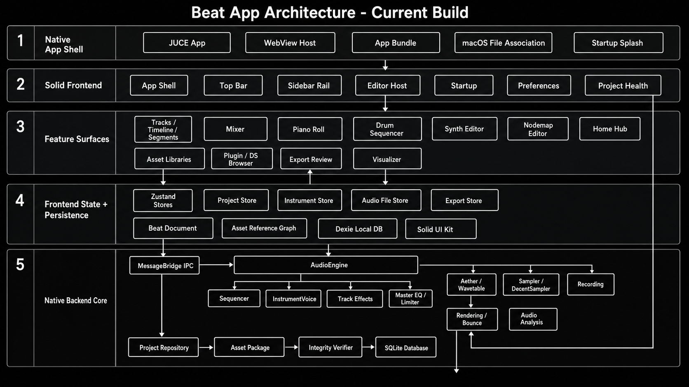

# Beat App Architecture - Current Build

This diagram is the precise source-of-truth companion to the generated visual overview. It tracks the current Solid frontend, native JUCE shell, IPC bridge, backend audio core, persistence layer, and verification surfaces.

```mermaid
flowchart TB
  subgraph native_shell["1. Native App Shell"]
    juce["JUCE App"]
    webview["WebView Host"]
    bundle["App Bundle"]
    file_assoc["macOS .beat File Association"]
    splash["Startup Splash"]
  end

  subgraph solid_frontend["2. Solid Frontend"]
    app_shell["App.solid.tsx / main.solid.tsx"]
    topbar["Top Bar / App Menu / Brand Mark"]
    sidebar["Sidebar Rail"]
    editor_host["Editor Host"]
    startup["Startup Readiness"]
    preferences["Preferences"]
    project_health["Project Health"]
    hotkeys["Contextual Hotkeys"]
  end

  subgraph feature_surfaces["3. Feature Surfaces"]
    tracks["Tracks / Timeline / Lanes / Segments"]
    mixer["Mixer"]
    piano["Piano Roll"]
    drums["Drum Sequencer"]
    synth["Synth Editor / Aether"]
    nodemap["Nodemap Editor"]
    home["Home Hub"]
    assets["Audio / Instrument / Component Libraries"]
    plugins["Plugin Browser / DecentSampler"]
    export_review["Export Review"]
    visualizer["Visualizer"]
    training["Training Auto Runner"]
  end

  subgraph frontend_state["4. Frontend State + Persistence"]
    zustand["Vanilla Zustand Stores"]
    project_store["Project Store"]
    instrument_store["Instrument Store"]
    audio_store["Audio File Store"]
    plugin_store["Plugin Store"]
    export_store["Export Store"]
    beat_doc["Beat Document Serializer"]
    asset_graph["Asset Reference Graph"]
    dexie["Dexie Local DB"]
    solid_ui["Solid UI Kit"]
    ipc_bridge["Frontend IPC Bridge"]
  end

  subgraph native_backend["5. Native Backend Core"]
    message_bridge["MessageBridge IPC"]
    audio_engine["AudioEngine"]
    sequencer["Sequencer"]
    voice["InstrumentVoice"]
    aether["Aether / Wavetable"]
    sampler["Sampler / DecentSampler Importer"]
    effects["Track Effects"]
    master["Master EQ / Limiter"]
    recording["Recording Capture / Planner"]
    render["Rendering / Bounce / Export"]
    analysis["Audio Analysis / FFT"]
    project_repo["Project Repository"]
    instrument_repo["Instrument Repository"]
    asset_package["Project Asset Package"]
    backup["Project Document Backup"]
    integrity["Project Integrity Verifier"]
    database["SQLite Database"]
  end

  subgraph verification["6. Verification Gates"]
    non_native["npm run verify:non-native"]
    design_system["verify:design-system"]
    daw_core["verify:daw"]
    document_roundtrip["verify:documents"]
    interactions["verify:interactions"]
    node_verify["verify:node-instrument"]
    backend_stress["BeatBackendStress"]
    native_build["Native Beat build"]
  end

  juce --> webview
  bundle --> juce
  file_assoc --> juce
  splash --> app_shell
  webview --> app_shell

  app_shell --> topbar
  app_shell --> sidebar
  app_shell --> editor_host
  app_shell --> startup
  app_shell --> preferences
  app_shell --> project_health
  app_shell --> hotkeys

  editor_host --> tracks
  editor_host --> mixer
  editor_host --> piano
  editor_host --> drums
  editor_host --> synth
  editor_host --> nodemap
  editor_host --> export_review
  editor_host --> visualizer
  sidebar --> assets
  sidebar --> plugins
  topbar --> export_review
  home --> assets
  home --> project_health
  training --> synth

  tracks --> project_store
  mixer --> project_store
  piano --> project_store
  drums --> project_store
  synth --> instrument_store
  nodemap --> instrument_store
  assets --> audio_store
  assets --> instrument_store
  plugins --> plugin_store
  export_review --> export_store
  project_health --> beat_doc
  solid_ui --> topbar
  solid_ui --> sidebar
  solid_ui --> editor_host
  solid_ui --> home

  project_store --> beat_doc
  instrument_store --> beat_doc
  audio_store --> beat_doc
  plugin_store --> beat_doc
  beat_doc --> asset_graph
  beat_doc --> dexie
  asset_graph --> project_health
  ipc_bridge --> message_bridge

  message_bridge --> audio_engine
  message_bridge --> project_repo
  message_bridge --> instrument_repo
  message_bridge --> asset_package
  message_bridge --> integrity
  message_bridge --> recording
  message_bridge --> render
  message_bridge --> analysis

  audio_engine --> sequencer
  audio_engine --> voice
  audio_engine --> effects
  audio_engine --> master
  audio_engine --> sampler
  voice --> aether
  sequencer --> voice
  render --> audio_engine
  recording --> audio_engine
  analysis --> audio_engine

  project_repo --> database
  instrument_repo --> database
  asset_package --> beat_doc
  asset_package --> integrity
  backup --> beat_doc
  integrity --> beat_doc

  non_native --> design_system
  non_native --> daw_core
  non_native --> document_roundtrip
  non_native --> interactions
  non_native --> node_verify
  backend_stress --> audio_engine
  backend_stress --> project_repo
  backend_stress --> asset_package
  backend_stress --> integrity
  native_build --> juce
  native_build --> message_bridge
```

## Current Architectural Truths

- The UI is Solid-owned. React bridges have been removed from the current app direction.
- `solid-ui` owns reusable primitives; feature folders own DAW-specific behavior.
- `EditorHost` dispatches the major work surfaces: arrangement, mixer, MIDI/drums, synth, Nodemap, export, visualizer, and modal/editor surfaces.
- The frontend project state is vanilla Zustand plus local undo history; transport/UI state is intentionally separate from undoable project state.
- `Beat Document` is the frontend serialization boundary. Native persistence is handled by repositories and project-asset helpers.
- `MessageBridge` is the native IPC boundary. It should translate requests and responses, not become the business-logic owner.
- `AudioEngine`, `Sequencer`, `InstrumentVoice`, effects, sampler, recording, rendering, and analysis are native C++.
- Nodemap is now a standalone modular-synth product direction. The native graph schema/evaluator, one-note audition, persistence, and DAW playback/export path exist; the frontend Aether compile bridge remains temporary compatibility scaffolding while editor/runtime polish continues.
- Project portability runs through the asset reference graph, native manifest repair, sidecar packaging, cleanup, and integrity verification.
- Release confidence comes from `verify:non-native`, document roundtrips, interaction verifiers, Nodemap verifier, native build, and `BeatBackendStress`.
