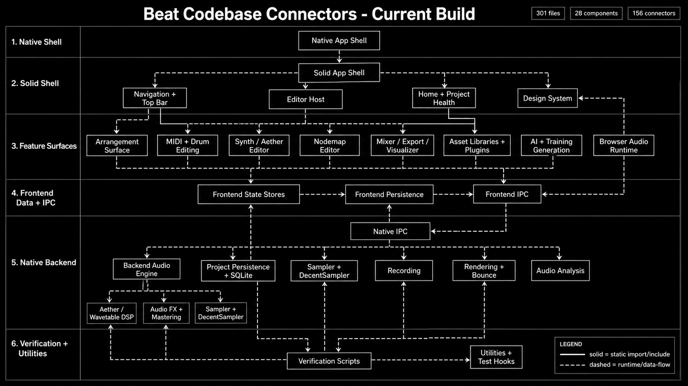

# Beat Codebase Visualizer

This file is generated by `scripts/generate-codebase-visualizer.mjs` from current TypeScript imports, C++ includes, and a small set of named runtime-boundary edges. Regenerate it after major structure changes.

- Interactive visualizer: [codebase-visualizer.html](./codebase-visualizer.html)
- Machine-readable data: [codebase-visualizer-data.json](./codebase-visualizer-data.json)
- Generated overview image: [codebase-connectors-current.png](./codebase-connectors-current.png)

```mermaid
flowchart TB
  subgraph n_1_native_shell["1. Native shell"]
    n_native_app_shell["Native App Shell<br/>3 files"]
  end

  subgraph n_2_solid_shell["2. Solid shell"]
    n_solid_app_shell["Solid App Shell<br/>2 files"]
    n_navigation_top_bar["Navigation + Top Bar<br/>5 files"]
    n_editor_host["Editor Host<br/>1 files"]
    n_design_system["Design System<br/>74 files"]
    n_home_project_health["Home + Project Health<br/>9 files"]
  end

  subgraph n_3_feature_surfaces["3. Feature surfaces"]
    n_arrangement_surface["Arrangement Surface<br/>18 files"]
    n_midi_drum_editing["MIDI + Drum Editing<br/>5 files"]
    n_synth_aether_editor["Synth / Aether Editor<br/>16 files"]
    n_nodemap_editor["Nodemap Editor<br/>3 files"]
    n_mixer_export_visualizer["Mixer / Export / Visualizer<br/>7 files"]
    n_asset_libraries_plugins["Asset Libraries + Plugins<br/>10 files"]
    n_ai_training_generation["AI + Training Generation<br/>4 files"]
    n_browser_audio_runtime["Browser Audio Runtime<br/>11 files"]
  end

  subgraph n_4_frontend_data_ipc["4. Frontend data + IPC"]
    n_frontend_state_stores["Frontend State Stores<br/>16 files"]
    n_frontend_persistence["Frontend Persistence<br/>4 files"]
    n_frontend_ipc["Frontend IPC<br/>2 files"]
  end

  subgraph n_5_native_backend["5. Native backend"]
    n_native_ipc["Native IPC<br/>3 files"]
    n_backend_audio_engine["Backend Audio Engine<br/>9 files"]
    n_aether_wavetable_dsp["Aether / Wavetable DSP<br/>36 files"]
    n_audio_fx_mastering["Audio FX + Mastering<br/>8 files"]
    n_sampler_decentsampler["Sampler + DecentSampler<br/>2 files"]
    n_recording["Recording<br/>8 files"]
    n_rendering_bounce["Rendering + Bounce<br/>2 files"]
    n_audio_analysis["Audio Analysis<br/>4 files"]
    n_project_persistence_sqlite["Project Persistence + SQLite<br/>14 files"]
  end

  subgraph n_6_verification_utilities["6. Verification + utilities"]
    n_verification_scripts["Verification Scripts<br/>18 files"]
    n_utilities_test_hooks["Utilities + Test Hooks<br/>7 files"]
  end

  n_native_app_shell -->|"runtime host"| n_solid_app_shell
  n_solid_app_shell -->|"static import: 2"| n_navigation_top_bar
  n_solid_app_shell -->|"runtime render"| n_navigation_top_bar
  n_solid_app_shell -->|"static import: 1"| n_editor_host
  n_solid_app_shell -->|"runtime render"| n_editor_host
  n_solid_app_shell -->|"static import: 3"| n_design_system
  n_solid_app_shell -->|"static import: 2"| n_home_project_health
  n_solid_app_shell -->|"runtime render"| n_home_project_health
  n_solid_app_shell -->|"static import: 1"| n_arrangement_surface
  n_solid_app_shell -->|"static import: 1"| n_synth_aether_editor
  n_solid_app_shell -->|"static import: 4"| n_mixer_export_visualizer
  n_solid_app_shell -->|"static import: 1"| n_ai_training_generation
  n_solid_app_shell -->|"static import: 6"| n_browser_audio_runtime
  n_solid_app_shell -->|"static import: 4"| n_frontend_state_stores
  n_solid_app_shell -->|"static import: 3"| n_frontend_persistence
  n_solid_app_shell -->|"static import: 1"| n_frontend_ipc
  n_solid_app_shell -->|"static import: 3"| n_utilities_test_hooks
  n_navigation_top_bar -->|"static import: 6"| n_design_system
  n_navigation_top_bar -->|"static import: 1"| n_arrangement_surface
  n_navigation_top_bar -->|"static import: 1"| n_midi_drum_editing
  n_navigation_top_bar -->|"static import: 4"| n_asset_libraries_plugins
  n_navigation_top_bar -->|"runtime route"| n_asset_libraries_plugins
  n_navigation_top_bar -->|"static import: 1"| n_browser_audio_runtime
  n_navigation_top_bar -->|"static import: 4"| n_frontend_state_stores
  n_navigation_top_bar -->|"static import: 1"| n_frontend_persistence
  n_navigation_top_bar -->|"static import: 1"| n_frontend_ipc
  n_navigation_top_bar -->|"static import: 3"| n_utilities_test_hooks
  n_editor_host -->|"static import: 1"| n_design_system
  n_editor_host -->|"static import: 2"| n_home_project_health
  n_editor_host -->|"static import: 3"| n_arrangement_surface
  n_editor_host -->|"runtime route"| n_arrangement_surface
  n_editor_host -->|"static import: 1"| n_midi_drum_editing
  n_editor_host -->|"runtime route"| n_midi_drum_editing
  n_editor_host -->|"static import: 3"| n_synth_aether_editor
  n_editor_host -->|"runtime route"| n_synth_aether_editor
  n_editor_host -->|"static import: 1"| n_nodemap_editor
  n_editor_host -->|"runtime route"| n_nodemap_editor
  n_editor_host -->|"static import: 2"| n_mixer_export_visualizer
  n_editor_host -->|"runtime route"| n_mixer_export_visualizer
  n_editor_host -->|"static import: 1"| n_asset_libraries_plugins
  n_editor_host -->|"static import: 1"| n_frontend_state_stores
  n_editor_host -->|"static import: 1"| n_utilities_test_hooks
  n_design_system -->|"static import: 1"| n_utilities_test_hooks
  n_home_project_health -->|"static import: 1"| n_navigation_top_bar
  n_home_project_health -->|"static import: 11"| n_design_system
  n_home_project_health -->|"static import: 1"| n_midi_drum_editing
  n_home_project_health -->|"static import: 2"| n_ai_training_generation
  n_home_project_health -->|"static import: 2"| n_browser_audio_runtime
  n_home_project_health -->|"static import: 13"| n_frontend_state_stores
  n_home_project_health -->|"static import: 7"| n_frontend_persistence
  n_home_project_health -->|"static import: 11"| n_frontend_ipc
  n_home_project_health -->|"static import: 7"| n_utilities_test_hooks
  n_arrangement_surface -->|"static import: 13"| n_design_system
  n_arrangement_surface -->|"static import: 3"| n_midi_drum_editing
  n_arrangement_surface -->|"static import: 10"| n_synth_aether_editor
  n_arrangement_surface -->|"static import: 2"| n_asset_libraries_plugins
  n_arrangement_surface -->|"static import: 3"| n_ai_training_generation
  n_arrangement_surface -->|"static import: 6"| n_browser_audio_runtime
  n_arrangement_surface -->|"static import: 34"| n_frontend_state_stores
  n_arrangement_surface -->|"state"| n_frontend_state_stores
  n_arrangement_surface -->|"static import: 2"| n_frontend_persistence
  n_arrangement_surface -->|"static import: 1"| n_frontend_ipc
  n_arrangement_surface -->|"static import: 10"| n_utilities_test_hooks
  n_midi_drum_editing -->|"static import: 7"| n_design_system
  n_midi_drum_editing -->|"static import: 1"| n_arrangement_surface
  n_midi_drum_editing -->|"static import: 2"| n_synth_aether_editor
  n_midi_drum_editing -->|"static import: 4"| n_ai_training_generation
  n_midi_drum_editing -->|"static import: 5"| n_browser_audio_runtime
  n_midi_drum_editing -->|"static import: 12"| n_frontend_state_stores
  n_midi_drum_editing -->|"state"| n_frontend_state_stores
  n_midi_drum_editing -->|"static import: 1"| n_frontend_persistence
  n_midi_drum_editing -->|"static import: 6"| n_utilities_test_hooks
  n_synth_aether_editor -->|"static import: 11"| n_design_system
  n_synth_aether_editor -->|"static import: 2"| n_ai_training_generation
  n_synth_aether_editor -->|"static import: 8"| n_browser_audio_runtime
  n_synth_aether_editor -->|"static import: 30"| n_frontend_state_stores
  n_synth_aether_editor -->|"state"| n_frontend_state_stores
  n_synth_aether_editor -->|"static import: 2"| n_frontend_persistence
  n_synth_aether_editor -->|"static import: 2"| n_frontend_ipc
  n_synth_aether_editor -->|"static import: 8"| n_utilities_test_hooks
  n_nodemap_editor -->|"static import: 2"| n_design_system
  n_nodemap_editor -->|"static import: 1"| n_browser_audio_runtime
  n_nodemap_editor -->|"static import: 5"| n_frontend_state_stores
  n_nodemap_editor -->|"state"| n_frontend_state_stores
  n_mixer_export_visualizer -->|"static import: 4"| n_design_system
  n_mixer_export_visualizer -->|"static import: 12"| n_frontend_state_stores
  n_mixer_export_visualizer -->|"static import: 1"| n_frontend_persistence
  n_mixer_export_visualizer -->|"static import: 2"| n_frontend_ipc
  n_mixer_export_visualizer -->|"static import: 4"| n_utilities_test_hooks
  n_asset_libraries_plugins -->|"static import: 13"| n_design_system
  n_asset_libraries_plugins -->|"static import: 2"| n_synth_aether_editor
  n_asset_libraries_plugins -->|"static import: 1"| n_nodemap_editor
  n_asset_libraries_plugins -->|"static import: 5"| n_browser_audio_runtime
  n_asset_libraries_plugins -->|"static import: 22"| n_frontend_state_stores
  n_asset_libraries_plugins -->|"state"| n_frontend_state_stores
  n_asset_libraries_plugins -->|"static import: 7"| n_frontend_ipc
  n_asset_libraries_plugins -->|"static import: 6"| n_utilities_test_hooks
  n_ai_training_generation -->|"static import: 4"| n_frontend_state_stores
  n_ai_training_generation -->|"static import: 1"| n_frontend_persistence
  n_ai_training_generation -->|"static import: 2"| n_frontend_ipc
  n_browser_audio_runtime -->|"static import: 1"| n_design_system
  n_browser_audio_runtime -->|"static import: 1"| n_synth_aether_editor
  n_browser_audio_runtime -->|"static import: 17"| n_frontend_state_stores
  n_browser_audio_runtime -->|"static import: 6"| n_frontend_ipc
  n_browser_audio_runtime -->|"native request"| n_frontend_ipc
  n_browser_audio_runtime -->|"static import: 1"| n_utilities_test_hooks
  n_frontend_state_stores -->|"serialize"| n_frontend_persistence
  n_frontend_state_stores -->|"static import: 2"| n_frontend_ipc
  n_frontend_persistence -->|"static import: 1"| n_design_system
  n_frontend_persistence -->|"static import: 1"| n_nodemap_editor
  n_frontend_persistence -->|"static import: 2"| n_ai_training_generation
  n_frontend_persistence -->|"static import: 1"| n_browser_audio_runtime
  n_frontend_persistence -->|"static import: 10"| n_frontend_state_stores
  n_frontend_persistence -->|"static import: 4"| n_frontend_ipc
  n_frontend_persistence -->|"native request"| n_frontend_ipc
  n_frontend_ipc -->|"static import: 2"| n_frontend_state_stores
  n_frontend_ipc -->|"IPC boundary"| n_native_ipc
  n_native_ipc -->|"command"| n_backend_audio_engine
  n_native_ipc -->|"command"| n_sampler_decentsampler
  n_native_ipc -->|"static include: 2"| n_recording
  n_native_ipc -->|"command"| n_recording
  n_native_ipc -->|"command"| n_rendering_bounce
  n_native_ipc -->|"command"| n_audio_analysis
  n_native_ipc -->|"static include: 7"| n_project_persistence_sqlite
  n_native_ipc -->|"command"| n_project_persistence_sqlite
  n_backend_audio_engine -->|"audio render"| n_aether_wavetable_dsp
  n_backend_audio_engine -->|"audio render"| n_audio_fx_mastering
  n_backend_audio_engine -->|"audio render"| n_sampler_decentsampler
  n_aether_wavetable_dsp -->|"static include: 2"| n_backend_audio_engine
  n_audio_fx_mastering -->|"static include: 2"| n_backend_audio_engine
  n_recording -->|"static include: 2"| n_backend_audio_engine
  n_recording -->|"capture"| n_backend_audio_engine
  n_rendering_bounce -->|"offline render"| n_backend_audio_engine
  n_project_persistence_sqlite -->|"roundtrip"| n_frontend_persistence
  n_verification_scripts -->|"verify"| n_design_system
  n_verification_scripts -->|"verify"| n_arrangement_surface
  n_verification_scripts -->|"verify"| n_nodemap_editor
  n_verification_scripts -->|"verify"| n_frontend_persistence
  n_verification_scripts -->|"verify"| n_backend_audio_engine
  n_utilities_test_hooks -->|"static import: 2"| n_design_system
  n_utilities_test_hooks -->|"static import: 2"| n_arrangement_surface
  n_utilities_test_hooks -->|"static import: 1"| n_nodemap_editor
  n_utilities_test_hooks -->|"static import: 2"| n_asset_libraries_plugins
  n_utilities_test_hooks -->|"static import: 1"| n_browser_audio_runtime
  n_utilities_test_hooks -->|"static import: 12"| n_frontend_state_stores
  n_utilities_test_hooks -->|"static import: 2"| n_frontend_persistence
  n_utilities_test_hooks -->|"static import: 2"| n_frontend_ipc
```

## Component Summary

| Component | Layer | Files | Incoming | Outgoing |
| --- | --- | ---: | ---: | ---: |
| Native App Shell | 1. Native shell | 3 | 0 | 1 |
| Solid App Shell | 2. Solid shell | 2 | 1 | 35 |
| Navigation + Top Bar | 2. Solid shell | 5 | 4 | 23 |
| Editor Host | 2. Solid shell | 1 | 2 | 21 |
| Design System | 2. Solid shell | 74 | 76 | 1 |
| Home + Project Health | 2. Solid shell | 9 | 5 | 55 |
| Arrangement Surface | 3. Feature surfaces | 18 | 10 | 85 |
| MIDI + Drum Editing | 3. Feature surfaces | 5 | 7 | 39 |
| Synth / Aether Editor | 3. Feature surfaces | 16 | 20 | 64 |
| Nodemap Editor | 3. Feature surfaces | 3 | 6 | 9 |
| Mixer / Export / Visualizer | 3. Feature surfaces | 7 | 7 | 23 |
| Asset Libraries + Plugins | 3. Feature surfaces | 10 | 10 | 57 |
| AI + Training Generation | 3. Feature surfaces | 4 | 14 | 7 |
| Browser Audio Runtime | 3. Feature surfaces | 11 | 36 | 27 |
| Frontend State Stores | 4. Frontend data + IPC | 16 | 187 | 3 |
| Frontend Persistence | 4. Frontend data + IPC | 4 | 23 | 20 |
| Frontend IPC | 4. Frontend data + IPC | 2 | 43 | 3 |
| Native IPC | 5. Native backend | 3 | 1 | 21 |
| Backend Audio Engine | 5. Native backend | 9 | 13 | 3 |
| Aether / Wavetable DSP | 5. Native backend | 36 | 2 | 2 |
| Audio FX + Mastering | 5. Native backend | 8 | 3 | 2 |
| Sampler + DecentSampler | 5. Native backend | 2 | 3 | 0 |
| Recording | 5. Native backend | 8 | 3 | 3 |
| Rendering + Bounce | 5. Native backend | 2 | 2 | 2 |
| Audio Analysis | 5. Native backend | 4 | 2 | 0 |
| Project Persistence + SQLite | 5. Native backend | 14 | 8 | 3 |
| Verification Scripts | 6. Verification + utilities | 18 | 0 | 5 |
| Utilities + Test Hooks | 6. Verification + utilities | 7 | 50 | 24 |
